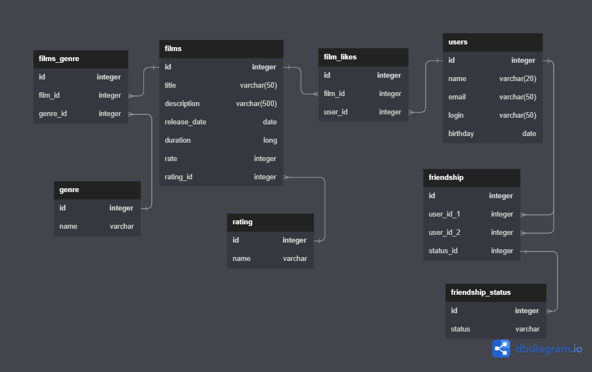

# java-filmorate
Программа представляет собой бэкенд для сервиса, который будет работать с фильмами и оценками пользователей.

Для работы с пользователями и фильмами созданы отдельные классы-сервисы, которые используют классы-модели для 
взаимодействия с данными. Класс-сервис для пользователей содержит методы для добавления, обновления, удаления и 
получения пользователей из данных. Аналогично работает и класс-сервис для фильмов.

Для обработки эндпоинтов созданы классы контроллеры для фильмов и пользователей.

ER диаграмма

Ссылка на ER диаграмму базы данных программы: https://dbdiagram.io/d/6481c669722eb77494a0c4f8

Примеры запросов для основных операций:

1. Получение 10 самых популярных фильмов

SELECT  f.name
COUNT(fl.user_id) AS likes
FROM film AS f
LEFT JOIN film_likes AS fl ON f.id = fl.film_id
GROUP BY f.name
ORDER BY likes DESC
LIMIT 10

2. Получение названий всех фильмов с жанром 'Триллер'

SELECT f.name,
FROM film as f
JOIN film_genre AS fg ON f.id = fg.film_id
JOIN genre AS g ON fg.genre_id = g.id
WHERE g.name = 'Триллер';

3. Получение названий всех фильмов с рейтингом 'PG-13'

SELECT f.name
FROM film as f
JOIN mpa AS r ON f.rating_id = r.id
WHERE r.name = 'PG-13';

4. Получение подтвержденных друзей user_id = 1

SELECT u.name
FROM user AS u
LEFT JOIN friendship AS fs ON u.id = fs.user_id_1 AND u.id = fs.user_id_2
LEFT JOIN friendship_status AS fss ON fs.status_id = fss.id
WHERE fss.status = 'подтвержденная' AND fs.user_id_1 = 1
GROUP BY fs.user_id_1